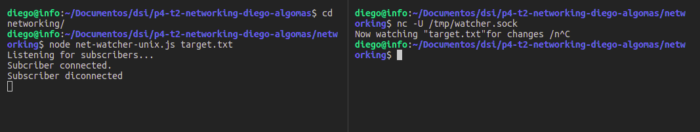
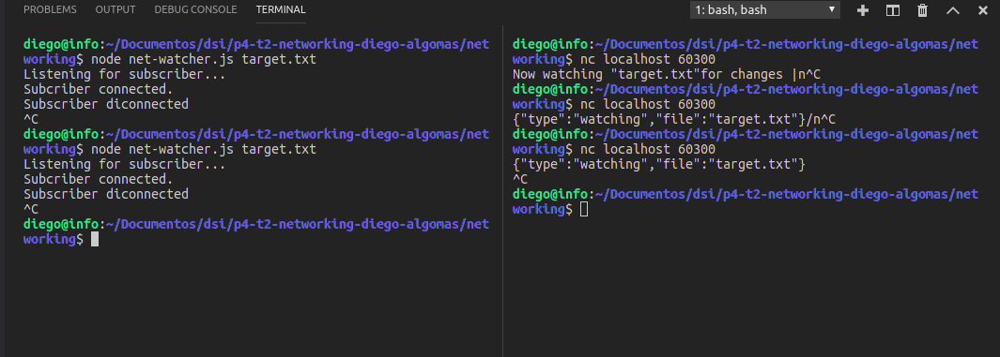
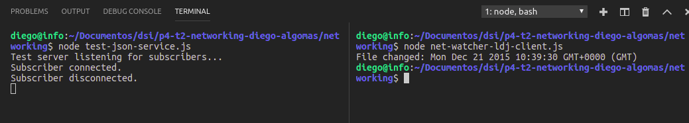
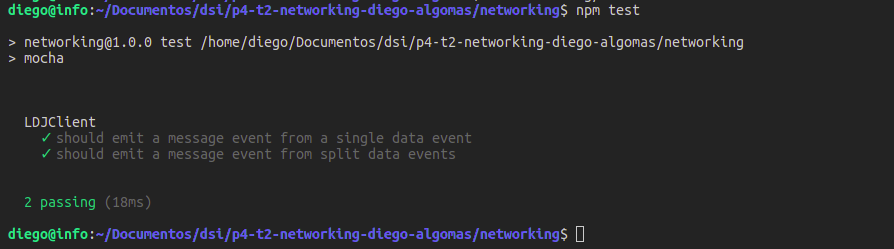
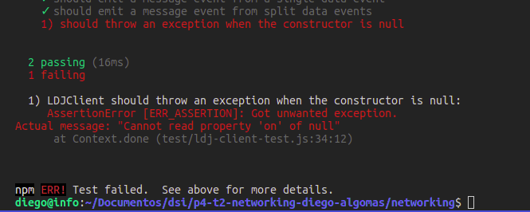
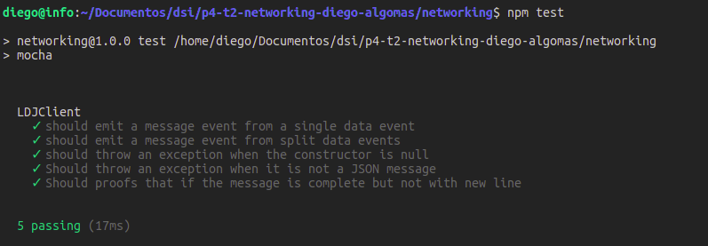
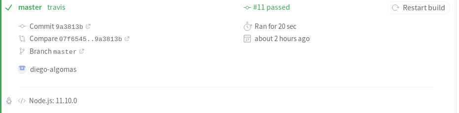

# p4-t2-networking-diego-algomas

En este capítulo del libro se empieza definiendo la conexión mediante sockets y su funcionamiento. En el fichero server.js podemos ver como se crea un servidor que se queda escuchando a un puerto en concreto las peticiones de los distintos clientes, el .listen llama a la función bind que une la escucha del servidor con el puerto concreto. 

En el fichero net-watcher.js que se encuentra dentro de la carpeta networking vemos como cogemos los modulos net y fs. Repasamos como en el caso de que el usuario no introduzca un argumento para vigilar el archivo el programa lanzará una excepción, que al no estar controlada parará el flujo del programa y lo cerrará. En la función de create server primero se informa de que se ha establecido la conexión a los dos extremos de la conexión a la parte del servidor mediante la escritura en consola mientras que al cliente se le informará mediante el write en la conexión. En la parte del watcher setup se empieza a vigilar el fichero especificado para que en caso de cambio se le notifique al cliente. Por último se añade un listener de la conexión para que en el momento que se produzca el evento 'close' se cierre la conexión y el watcher del fichero. La callback acaba en un listen que produce que el objeto que devuelve la callback haga un bind al puerto en concreto al que tiene que escuchar para las conexiones.    

Para probar el fichero anterior se ha de ejecutar distintos comandos en varias consolas. Con el comando *watch -n 5 touch target.txt* donde el número signigica cada cuanto tiempo se ha de esperar para hacer el comando touch sobre el fichero target.txt. En otra consola deberemos ejecutar nuestro servidor que nos proporcionará el servicio. Mientras que con el comando *nc localhost 60300* nos conectaremos como clientes, el nc es un programa de utilidad de sockets mientras que se le especifica la dirección de conexión con el puerto al que nos queremos conectar. En el caso de no tener la utilidad de nc se podrría usar la utilidad de *telnet*. 

;

Para mejorar nuestras funcionalidades, hacer casos de prueba y además ser capaces de dar una mayor versatilidad a nuestro código utilizaremos los ficheros JSON de manera que se puedan comunicar mejor cada uno de los extremos de la comunicación. Para ello tendremos que tener en cuenta que un fichero JSOn está compuesto por distintos pares de valores key-value. En nuestro caso se corresponden dos tipos de mensajes los de esperando por conexión y los de cambio de fichero. Usando el *JSON.stringify* podemos enviar por el socket el tipo de paquete JSON de una manera sencilla como se ve en el fichero net-watcher. Y nos da un resultado como este:

En el fichero net-watcher-client en su primera versión podemos observar como crea una conexión a un servidor por medio del connect del paquete 'net'. Además también se usa el *JASON.parse para descifrar el mensaje cada vez que llega un evento del tipo 'data'. 

Este fichero tiene problemas como que se asume que todo el mensaje llegará en un chunk de datos por lo que puede traer grandes problemas en un estado normal de aplicación de red. Para ello, se nos sugiere que creemos una extensión de la clase eventEmitter en una carpeta que por convenio se llama lib. Para ello usaremos la herencia y extenderemos la clase evenEmitter e implementaremos un método para unir todos los mensajes de manera que se espere al retorno de carro para enviar el mensaje entero. Además mediante el *module.exports*  se puede acceder al código de una manera muy sencilla. El código se encuentra en la clase net-watcher-ldj-client.js donde se ve en detalle el método usado. 

## Versioning

Para la semántica de las versiones de cada uno de los productos se utiliza el formato de tres números separados por puntos del tipo x.x.x . El primero de estos números se denomina el mayor que hace refencia a grandes actualizaciones que pueden hacer que deje de ser compatible con las versiones anteriores. El segundo número hace referencia al minor que se actualiza cuando se añaden funcionalidades nuevas al código pero se sigue manteniendo las funcionalidades con las versiones anteriores. Por último, el tercer número se refiere al patch que hace referencia a los distintos arreglos de bugs o pequeás módificaciones pensadas para modificar errores y solucionar problemas de funcionalidad. A la hora de usar el npm se suele añadir la etiqueta de -save-exact o -E que produce que solo se actualizen las versiones de nuestros módulos al último minor lanzado pero no actualize a un mayor superior protegiendo a que nuestro programa tenga modulos para los que no fue escrito o se pierdan funcionalidades con las que se contaban a la hora del diseño. 

## Mocha

A la hora de crear pruebas con Mocha para testear nuestro código, la herramienta de Mocha busca el directorio de test de manera determinada para buscar el código fuente a ejecutar. En el fichero para la creación del test tendremos que llamar al método de Mocha *describe* donde el primer argumento es el nombre del contexto que vamos a crear y el segundo es la función que hará la prueba. Dentro de esta función llamaremos al *beforeEach* de manera que se le pasará una función donde se inicializarán las variables necesarias. A continuación se llamará a *it* que tendrá como primer argumento una descripción de lo que se va a testear y como la llamada es asincrona como egundo argumento definiremos la función a la que llamar cuando se acabe de ejecutar la prueba de la propia función. En nuestro caso dentro de la función crearemos un listener que esperará el evento de mensaje y si el mensaje es igual al esperado continuará y mandará la seña *done()* que hará saber al mocha que ha terminado de manera exitosa. Y a continuación fuera del listener se emitirá el mensaje en si para hacer la prueba. 

El comando npm -y crea el fichero package.json y al ejecutar el npm install --save-dev y la version y nombre de lo que queramos instalar se añadirá a la lista de dependencias necesarias para desarrollar. Luego, introduciedo en el fichero package.json en el apartado de script se añade *"test" : "mocha"* de manera que al ejecutar npm test se ejecuta el mocha. 

## Testability

Para mejorar las pruebas que se van a aplicar hemos de modificar nuestro fichero de pruebas ldj. Para asegurar que un mensaje puede llegar en múltiples data vamos a modificar un it y vamos a enviar el mensaje en tres partes distintas para probar que nuestra librería los agrupa de manera correcta.Esta modificación la haremos en el ldj-client-test.js. 
A la hora de cambiar el fichero para asegurar que lanze una exepción, desde la primera ejecución del test se aprueba porque aunque no haya un throw por el stream definido a null si la hay cuando se intenta iniciar un listener a un null. De todas maneras por mentener la corrección se añade al constructor una comprobación para asegurar que el stream pasado no es nulo. La comprobación que estaba haciendo todo correcto en la primera ejecución se puede observar en la siguiente foto que por medio del assert.NotThrowException de manera que al lanzar una excepción nos la mostrará. 

## Robutness

En nuestro programa siguen habiendo grandes problemas de robustez, en el caso de que el mensaje recibido no esté formateado de manera correcta como un JSON. El método de JSON.parse lanzará un error. Para ello deberíamos rodearlo de un try/catch de manera que al lanzar la excepción sea manejada en el momento. En el caso de que no se hiciera dentro del try catch el programa mandaría una excepción y al no estar controlada producirá el aborto de la ejecución. 

En el caso de que el mensaje llegue sin un salto de linea no entrará dentro del bucle while ya que no encontrará nunca el salto de línea que está esperando. Pero a la señal de close entrará en el listener de close que manejará el mensaje JSON en caso de que este el cierre del parentesis. El cliente si debería enviar un mensaje de close a sus listener pero después de haber recibido un mensaje de close por parte del servidor. 

## Travis

También hemos añadido la integración continua usando Travis

